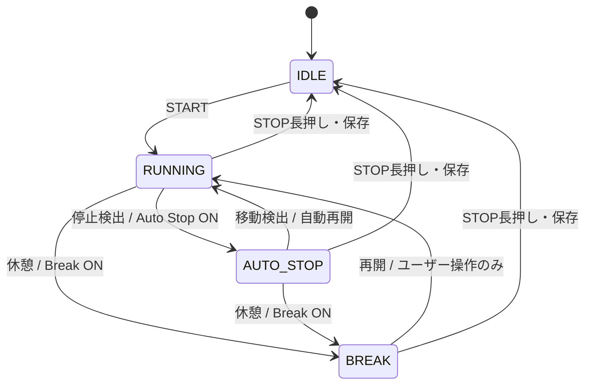

# Auto Stop / Break（Issue #7）

## UXと標準操作

[設計原則](design-principles.md)の **Simple by default, powerful by choice.** に従う。
Auto Stop / Break は独立した Opt-in、旧設定・新規設定とも OFF。
標準は START → RUNNING → STOP長押し。STOP長押しだけは全ユーザー共通の誤終了防止。
「走る意思がある限りスマホを触らなくてよい」「明示的に休むときだけ休憩を押す」。
センサーは事実を測り、アプリは推定し、人間が後から訂正できる。

## 設定とUI

| Auto Stop | Break | 操作・挙動 |
|---|---|---|
| OFF | OFF | START / STOP長押しのみ。実時間の時計・既存距離計算 |
| ON | OFF | 自動停止・再開、STOP長押し |
| OFF | ON | 大きな休憩 / 再開ボタン、STOP長押し |
| ON | ON | 自動停止・再開、AUTO_STOPからも休憩可能、STOP長押し |

設定は既存音声設定と同じ AsyncStorage 方式。`@runjourney/run-features/v1` の欠損値は false。
Run開始時に features を保存し、そのRunの設定を固定。変更は次のSTARTから適用。
既存進行中Runに features がなければ両方OFFとして継続する。
RUNNINGは距離・実走時計・平均ペース、AUTO STOPは停止中/自動再開の案内、BREAKは休憩時間・再開を表示。
BREAK中は移動しても自動復帰しない。現在の休憩表示は累積休憩時間。
STOPは1.5秒。横方向の進捗、押し続ける案内、保存中表示。途中で離す/画面を離れるとキャンセル。
Pressableのlong pressとStopHoldの経過時間確認を併用し、UIの停止中refとRepositoryの直列化で二重保存を防ぐ。

## 状態遷移

従来の単一PAUSEを分離した理由は、身体が止まった事実の推定と、本人が休む意思を同一にしないため。AUTO_STOPは物理的な停止の推定であり理由を分類しない。BREAKは本人の意思。
IDLEはactive draftなしで表現する。eventsの最後のstateが進行中状態。

## 時間とPace

始終の timestamp と `events: [{ timestamp, state, source, confirmedAt? }]` を保持。timestampは実効時刻、confirmedAtはセンサー判定の確定時刻。手動BREAK/再開は操作timestampのまま。
- wallClockElapsed: STARTから現在/STOPまで。
- autoStoppedDuration: AUTO_STOP区間の合計。
- breakDuration: BREAK区間の合計。
- activeRunningTime: wall − auto stop − break。

開いている区間は現在時刻、保存後はendedAtで閉じる。元イベントを上書きしない。
10分走行→2分停止→10分走行ならwall22分/active20分。
10分走行→3分休憩→10分走行ならwall23分/active20分。
`run-model.ts` の timeModel / paceTime / effectiveRun を共通の算出入口にする。effectiveTimelineは既存互換の補助API。

| Pace Mode（内部API、切替UIは未実装） | AUTO STOP | BREAK |
|---|---|---|
| active / 実走（DEFAULT） | 除外 | 除外 |
| with-break / 休憩込み | 除外 | 含む |
| wall / 全経過 | 含む | 含む |

平均ペース・5分ラップ音声はDEFAULTのactive時間。5分通知は停止・休憩中の時間を数えない。
Android常駐RunAnnouncerへactiveMs/更新時刻/paused/confirmedActiveMsを渡す。Auto Stop ONでは、音声の判定時計を処理済みGPSが裏付ける時間までに制限し、未確定の停止候補による先走り通知を防ぐ。画面の時計は候補中には仮に進み、確定時に遡って補正される。
既存のTTS・Audio Focusを再利用。音声設定ON時に停止/休憩/再開を短く通知。
Run IDとイベントindexをnative prefsで記憶し重複通知を抑える。バッチ内の全遷移を順番に渡し、初期化待ちを含めて発話キューに保持する。音声OFFなら通知しない。
Auto Stop ONでは確定済み実走時間5分のラップpayloadが届いたら通知可能となり、従来の10秒を実走時間へ足して待つ方式は使用しない。GPS配信/JS/TTSによる実際の発話遅延はあり得る。Auto Stop OFFは既存の約10秒の通知猶予と連続時計を維持する。
Android以外の音声は既存どおり未対応。

## Raw GPS / Effective distance

停止・休憩中もバックグラウンドtaskとRaw points保存は継続。
RUNNINGに属する辺だけを既存accuracy/速度/最小距離フィルタへ渡す。
停止・手動再開イベントを跨ぐ辺、および停止点と接する辺を保守的に除外。確定済みセンサー再開（confirmedAtあり）では、移動開始候補のGPS点を新しい距離segmentの始点とし、その点から確認中の実移動の辺を復元する。停止点から候補点へは接続しない。旧イベントは従来の境界処理を維持する。
BREAK中300m歩いても再開地点へ橋渡ししない。最初の再開fixから次のfixの辺も除外し、以後新しいsegmentとして加算。
境界で若干の過少計測はあり得るが距離jumpを優先して防ぐ。
Raw pointsを削除せず、派生distanceMetersは再計算可能。
GPSの重複timestampは従来同様に統合し、遅延fixは保存するが過去の状態を再判定しない。

## 停止推定（仮値・実走検証待ち）

全定数は RUN_CONTROL（src/utils/run-model.ts）に集約。
- 停止: speed（欠損時は点間速度）0.6m/s以下、固定anchorから8m以内が5秒継続。RUN_CONTROL.stopMs=5000。位置証拠による補完: 通常gapの連続点が8m内にあり、変位がaccuracyノイズ幅（min(8m, max(3m, 前後accuracy平均))）以下、speed欠損または1.2m/s未満ならjitterとして扱う。報告speedが高くても、点間変位3m未満かつ水平点間速度0.6m/s以下なら、その場足踏みの停止候補にできる。速度単独を絶対条件にしない。
- 再開: 停止anchorから10m以上 AND speed 1.2m/s以上。両閾値は維持する。speed欠損時は点間速度を使用。さらに良好な移動fixを2回連続で確認する（RUN_CONTROL.resumeFixes）。各点間に3m以上の移動があり、候補originからも3m以上の変位が必要（movementStep）。
- accuracy: 0〜20mの明示的な値を持つfixのみ。
- 通常gapは15秒。精度不良/spikeは保留。最後の良好fixから60秒を超えた候補は破棄し、新たに観測する。15〜60秒のgapでは、明示的speed<=0.6m/sの良好fixが同じ8m停止originに戻った場合だけ停止候補を裏付けられる。speed欠損gapは保留。端点からの推定であり、その間の連続静止の証明ではない。
- Resumeは15秒超gapで移動候補を破棄し、新しいfixから観測し直す。未観測の走り始めは復元しない。
- 点間/報告速度12.5m/s超のspikeは判定に使わない。Rawとしては保持する。
- 停止0.6/再開1.2m/sと8/10mのhysteresis。
- Android位置要求は5秒。Auto Stop ONのRunのみdistanceInterval=0、OFFは既存の5m。静止fixが必要なためON時だけ5m条件を外す。

停止確認は20秒から5秒へ短縮した。20秒は5分ラップの約6.7%であり、リアルタイム評価に混入させられない。速度差とradiusは維持し、短縮による誤再開を抑えるため連続移動fixを確認する。すべて実走で調整する仮値。
実走前に精度完成とは判断しない。GPS欠損時はRUNNING時計を継続/停止中は停止状態を維持。

### Detection latency ≠ Activity time

5秒は停止を確定するための観測時間であり、走行成績へ含める時間ではない。
- RUNNING中の良好な低速fixで `detector.stillSince` と固定anchorを保持する。
- 5秒成立するとAUTO_STOPイベントのtimestampをstillSince、confirmedAtを成立fix時刻として追記する。待機中の5秒とGPS jitterの辺を時間・距離・Pace・Lapから遡って除外する。
- 4.9秒ではイベントを作らない。2秒の低速後に正常走行へ戻る等、成立しなければ候補を破棄し、時間も距離も通常RUNNINGのまま。
- AUTO_STOP中の移動は `detector.movement: { startedAt, origin, fixes }` に仮保存する。10m AND 1.2m/sと連続移動条件の成立後、最初の移動候補fixのstartedAtまでRUNNINGを遡って追記し、確認中の走行時間・候補点からの距離を復元する。
- 低速化/変位不足/GPS gapで移動候補を破棄する。accuracy不良/spikeは期限付き保留。未確定候補から履歴イベントを作らない。
- 候補を含むdetectorは既存draftへ保存され、JS再生成後も確認を継続できる。detector.version=3。version=2の5秒候補を引き継ぎ、旧20秒方式の未確定候補だけ破棄する。確定済みイベントは変更しない。
- 実際の停止/移動がGPS fix間で始まった場合、その正確な時刻・距離は捏造せず、最初に観測した候補fixまでを補正範囲とする。5秒はGPS cadenceによって5秒以上で確定することもある。
- BREAKは操作時刻のみ。Auto Stop OFFでは候補や遡及補正を適用しない。

4:00走行 → 候補開始 → 5秒後停止確定 → 候補開始から2:00停止 → 移動候補/再開確定 → 1:00走行なら、実走5:00。観測5秒を足して5:05にしない。
未確定の候補が5分境界を跨いでも、音声は確定時間上限とラップpayloadの照合で先に発火しない。GPS欠損中のAuto Stop ONの音声は、再び有効なGPSで時刻を裏付けるまで遅れることがある。
その場足踏みは移動していなければAUTO_STOPになり得る。

## 永続化・互換性・Issue #14

既存draft/historiesのv1 keyとRepositoryの直列化を維持。events/features/detectorは追加のoptional field。
破壊的migrationなし。旧RunRecordはイベントなしのRUNNINGとして元の計測意味を維持。
GPS taskが状態/検出anchorを保存するため、JS再生成後も判定候補とBREAKを復元する。
OSによるforce-stop等でGPSが届かなかった期間の状態を推測で補わない。
履歴保存→draft削除の順番とID重複排除を維持。

Raw GPS / Original Record → Stop/Break Events → 将来のEdit Operations (#14) → Effective Run → 時間/距離/Pace/EXP/Journey。
#7では停止区間訂正という最初の実用ユースケースを実装する。#14では汎用Edit Operations、GPS異常編集、Run分割/結合、Activity/タイトル/メモ、Undo/Redoへ一般化する。
今回未実装: 汎用編集/Undo、3モード設定UI、センサー融合/ML、EXP/Journey完全連携、Export/Import。

## 2026-10-03実走調査・versionCode 5

実走は約45分/6.18km、Auto Stop/Break/音声ON。3〜4回、確実に5秒以上、その場で弾んだ場面があり、画面変化・停止/再開音声を確認できなかった。

**今回の実走の根本原因は、端末の保存GPSをまだ取得できていないため未確定。** 旧版には実診断ログがなく、ユーザー申告だけからaccuracy・速度・callback間隔を断定しない。コードと再現テストでは以下を確認した。

- SettingsのAsyncStorage値はSTART時featuresへsnapshotされる。次STARTから適用し、復元はsnapshotを維持する。画面OFF/foreground共通のlocation task→appendActivePoints→detectStop→同じdraft保存経路。距離に届くRaw GPSが検出器にも届く。
- 旧版で0/16/32秒の良好・静止fixを入力すると、15秒gapで候補が毎回失われ、一度も停止しない。位置要求5秒は配信保証ではない。インストール済みSDK57のAndroidコードは距離条件0を受け取り、背景でもdeferred interval/distance=0なら配送対象になる。端末の実配信間隔は診断で確認する。
- accuracy不良即リセット、speed欠損時のjitter由来速度、位置は安定していても報告speedが高いケースも候補を失う。今回、観測不能と移動証拠を分離した。停止/再開0.6/1.2m/s、8/10m、accuracy20m、5秒は変更していない。
- 音声は最後のイベントだけを渡していたため、まとめて停止/再開が届くと停止音声を落とす。全イベントと永続cursorを使い、TTS初期化待ち/発話中の遷移もキューに保存する。Audio Focus否認・TTS失敗はnative診断statusへ記録する。ただし実機音声の到達は次回確認する。

### Diagnosticsの取得

Standalone Test版のみ、設定→Auto Stop Diagnostics、または履歴→走行詳細→この記録のDiagnostics。最新情報に更新→コピー/共有→会話へ貼り付ける。

features snapshotと現在設定を別に表示。各GPSについてtimestamp/receivedAt/state/accuracy/reported speed/effective speed/点間変位/origin変位/gap/候補開始・age/decision/reasonを保存する。`StopReason`に理由を集約する。START/CONTINUE/RESET/HOLD/SKIP/STOP_CONFIRMED/RESUME_CONFIRMEDを区別。欠損項目は未観測。通常画面にログを表示せず、座標はレポートから除く。

既存draft/RunRecordにoptional diagnosticsを追加し、最近720 entriesと全区間のdecision/reason countsを保存。START時Test版だけ有効。Raw GPSは全件保持。TASK_ERROR、native TTS status/cursorも確認できる。native statusは取得時点の端末全体の音声Service状態であり、履歴当時の状態の証明ではない。

旧Runでも保存GPSを読み取り、**v4の凍結した判定器の再判定**と現在判定器の再判定を実記録とは別表示する。手動BREAKイベントは反映する。旧ログを捏造せず、保存データを書き換えない。Replayは未観測区間や実際のTTSを証明できない。今回45分のRunのsnapshot・actualEvents・quality・legacyCandidateLossReasonsを取得後、根本原因を絞る。

### History correction / Effective Run

履歴一覧をタップすると詳細。AUTO_STOPとBREAKの開始/終了/duration/種別、現在の含む・除外状態を表示。各行で「走行に含める」「走行から除外する」を切り替える。手動BREAKも同じ構造なので訂正対象に含めた。

`stopOverrides[イベントindex:timestamp:state] = { included, updatedAt }`を既存履歴keyへ保存する。元のpoints/events/始終・作成・更新timestamp/元distanceMetersは書き換えない。元イベント順序とIDを保ち、将来#14の操作へ一般化できる。不存在intervalへの編集は拒否する。訂正結果は再起動後も維持される。

Original Record + Overrides → effectiveEvents/effectivePoints → effectiveRun。除外中は時間・距離を除き、停止点/境界を橋渡ししない。IncludeはRaw GPSの区間距離を再評価する。含めた区間だけaccuracy20mと8m移動anchorを追加し、静止jitterの長いpolylineを復活させない。accuracy不良点はsegmentを切る。既存のaccuracy50m/最小3m/最大12.5m/sフィルタも通す。Rawなし・微小移動は距離復元できない。安全側の過少計測があり得る。

未訂正の通常GPSは従来フィルタと境界処理を維持する。非有限/負accuracy/範囲外座標/非有限timestampは距離へ加算しない。古い有効RunRecordにmigrationは不要。イベント・overrideなしは連続RUNNINGとして計算する。

時間・距離・平均Pace・5分Lap・履歴詳細/一覧・Voiceは同じEffective Runを参照。各辺をまず**Raw GPS時刻でフィルタ**し、その後active clockへ配置する。Lapは境界を比例配分し、全Lap合計が同じ対象期間のtotalと一致する。Generic analyzePointsは既存APIとして保持する。停止時間の訂正後もactive/time/paceを同じモデルから求める。

### #17の共通不具合

旧Voice payloadはtotal=作成時点のrun.distanceMeters、lap=5分境界までだった。例: 5分時点300m、5分10秒時点400mで作成すると、初回通知がtotal0.4km/lap0.3kmになる。今回は両方を同じ5分境界へ揃え、合計Lapとの一致をテスト。画面は最新totalなので遅れた音声と表示の時点差は残り得る。今回の実走不整合がこれだったかは未確定で、#17はOPENを維持する。

### 次回実走

- Test版v5とGit hash・既存履歴を確認。Auto Stop/Break/音声ON後に新しいSTART。
- 通常走行、STOP短押し/途中解除、完全静止とその場足踏みをそれぞれ10〜15秒。5秒確認でもGPS到着まで状態確定は遅れる。
- AUTO_STOP表示/時計補正/停止音声、走り出しの自動再開・時間/距離回復・再開音声。画面OFFでも試す。
- RUNNING/AUTO_STOP→BREAK。BREAK中に歩いても自動再開しない。手動再開。active5分音声を確認。
- STOP1.5秒、履歴保存、距離jumpなし。停止区間を含める→時間・距離・Pace/Lapが再評価→除外して元へ戻る。
- 成否にかかわらずDiagnosticsをコピー/共有。場所、実際の動き（完全静止/足踏み/走行）、停止/再開までの秒数、画面OFF、建物/GPS状況を添える。
- 調整候補: accuracy noise幅、候補保留60秒、gap15秒の裏付け条件、0.6/1.2m/s、8/10m、2fix/3m。ただし診断結果を先に読む。#7は実走検証待ちOPEN。

### v5の自動検証・ビルド

- Focused: diagnostics / correction-model / correction-UI / background-stop / latency / voice、6 suites / 41 tests PASS。
- Full: 12 suites / 81 tests PASS。STOP長押しの既存回帰テストを含む。
- typecheck / lint: PASS、警告なし。RunAnnouncer release Kotlinコンパイル成功。
- correctionの原データ不変・保存/再読込、include/excludeの復帰、jitter/300m BREAK境界、時間/Pace/Lap再計算、非有限GPS・時刻、旧互換、背景snapshot経路を検証。
- versionCode 5、applicationId/signing/data sandboxは維持。署名鍵file SHA-256は既存の `221E0A3106AA4C3CCC154E0A418B55020B3F9EA6E84F92E8749CD9E2F39F5E58` と一致。
- commit後に `npm run android:test:build`。APK内 `assets/app.config` のbuildGitHashとHEAD、非debuggable/JS bundle/署名を検証。端末がadb接続されればTest版だけ `adb install -r`。
- 実機のタッチ/TTS/Audio Focus/画面OFF/OS復元/今回のGPS原因特定は端末検証待ち。推測でIssueをcloseしない。

## 今晩の実走チェックリスト

- Test版の履歴が残っていることを確認。SettingsでAuto Stop ON / Break ON、音声ON。
- START、通常走行、STOP短押しと途中解除で終了しない。
- 信号待ち：AUTO STOP、時計停止、走り出して自動再開（画面OFFでも確認）。
- AUTO STOP中→休憩、RUNNING→休憩。BREAK中に歩いても復帰しない。再開ボタンで復帰。
- active時間5分の音声を確認（停止候補の観測5秒・停止/休憩時間は数えない）。
- 各状態でSTOP長押し、保存履歴と距離jumpなしを確認。
- 誤判定は場所、実際に走行/停止していたか、停止/再開までの秒数、GPS/建物状況をメモ。
- 実走後に速度0.6/1.2、距離8/10、5秒、連続移動2fix/3m、accuracy20m、gap15秒を調整。

自動テストはモデル・Repository・設定・音声連携・ボタン/走行画面を検証。実機でのタッチ、TTS/Audio Focus、画面OFF、OS復元・バッテリーは実走検証待ち。
STOP不能/GPS欠損/大きな誤判定があれば記録を終了し、以後はAuto Stop OFFで利用する。

## 初回実装の検証結果（2026-10-02、versionCode 3）

- Focused: run-model / run-persistence / run-voice / stop-button / run-screen、5 suites / 33 tests PASS。
- Full: npm test -- --watch=false、7 suites / 41 tests PASS。
- npm run typecheck / npm run lint: PASS（警告なし）。
- STOPの実際のタッチ、TTS/Audio Focus、画面OFF・OSによる再生成は端末実走検証待ち。

## 初回のStandalone Test APK（versionCode 3）

- ビルド: `npm run android:test:build` / `app:assembleStandaloneTest` SUCCESS。
- `app.runjourney.mobile.test` / versionCode 3 / RunJourney Test / 非debuggable。
- 埋め込み最終JS bundleの一致とAPK署名を検証。PC/Metro/USBなしで実行する構成。
- 既存debug.keystoreのSHA-256は生成前後で同一。署名証明書SHA-256: `fac61745dc0903786fb9ede62a962b399f7348f0bb6f899b8332667591033b9c`。
- APK: `D:\working\RunJourney\android\app\build\outputs\apk\standaloneTest\app-standaloneTest.apk`
- APK SHA-256: `90E587577408098D207BCDE7AB95496FAB61181E3CFAAE400F2FB34996B1BAE0`。
- SO_51B: 初回ビルド後に接続し、versionCode 3の上書き導入成功。今後も `adb -s <serial> install -r <APK>` で上書きする。uninstallは禁止。
- ビルドはcommit前のため画面のBuild Git hashは開始時HEAD `74b0111`。今回のAPKはversionCode 3で識別する。

## 5秒・遡及補正の検証と再ビルド

停止4.9秒/5秒、確定/候補時刻、待機中jitterの再計算、候補解除、再開時間/距離復元、精度不良/gap、速度欠損、候補復元、旧候補互換、BREAK/OFF、4分+2分停止+1分、5分境界直前の音声抑止をテストする。
本修正版はversionCode 4。検証とcommitの後、`npx expo prebuild --platform android --no-install --no-clean`、`npm run android:test:build`で作成する。expo-constantsのcreateExpoConfigは各ビルドでHEADを取得する。APK内のapp.configのbuildGitHashとcommit hashの一致を検証してから、Test版だけをadb install -rする。
既存署名鍵、applicationId、保存領域を維持する。Issue #7は引き続きOPEN/実走検証待ち。

検証結果: focused 4 suites / 42 tests PASS、full 8 suites / 60 tests PASS。typecheck / lintとも警告なし。GPS実走精度は未検証。
