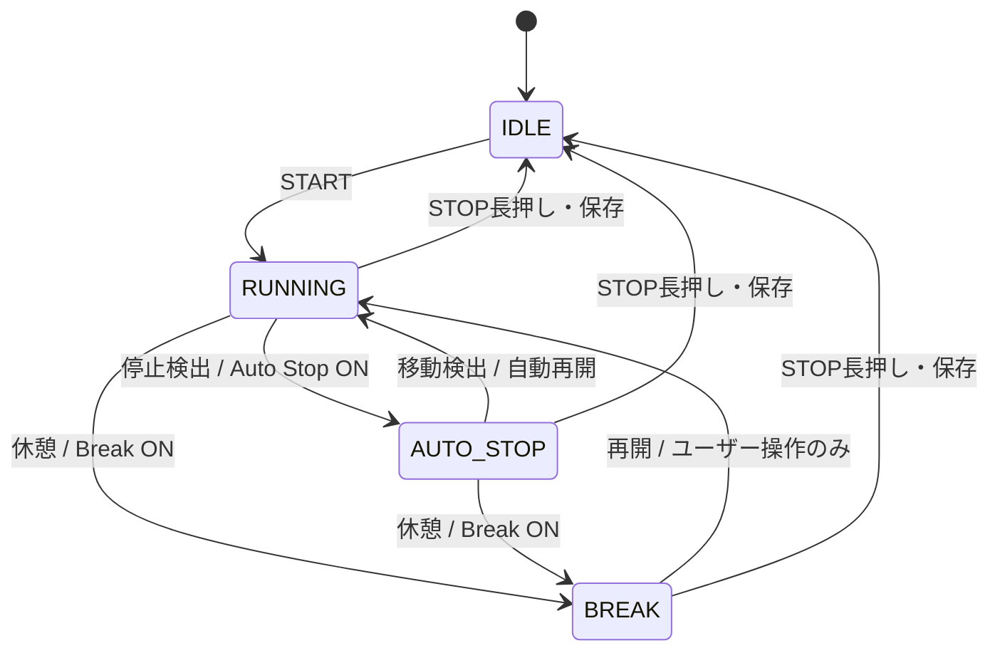

# Auto Stop / Break（Issue #7）

## UXと標準操作

[設計原則](design-principles.md)の **Simple by default, powerful by choice.** に従う。
Auto Stop / Break は独立した Opt-in、旧設定・新規設定とも OFF。
標準は START → RUNNING → STOP長押し。STOP長押しだけは全ユーザー共通の誤終了防止。
「走る意思がある限りスマホを触らなくてよい」「明示的に休むときだけ休憩を押す」。
センサーは事実を測り、アプリは推定し、人間が後から訂正できる。

## 設定とUI

| Auto Stop | Break | 操作・挙動 |
|---|---|---|
| OFF | OFF | START / STOP長押しのみ。実時間の時計・既存距離計算 |
| ON | OFF | 自動停止・再開、STOP長押し |
| OFF | ON | 大きな休憩 / 再開ボタン、STOP長押し |
| ON | ON | 自動停止・再開、AUTO_STOPからも休憩可能、STOP長押し |

設定は既存音声設定と同じ AsyncStorage 方式。`@runjourney/run-features/v1` の欠損値は false。
Run開始時に features を保存し、そのRunの設定を固定。変更は次のSTARTから適用。
既存進行中Runに features がなければ両方OFFとして継続する。
RUNNINGは距離・実走時計・平均ペース、AUTO STOPは停止中/自動再開の案内、BREAKは休憩時間・再開を表示。
BREAK中は移動しても自動復帰しない。現在の休憩表示は累積休憩時間。
STOPは1.5秒。横方向の進捗、押し続ける案内、保存中表示。途中で離す/画面を離れるとキャンセル。
Pressableのlong pressとStopHoldの経過時間確認を併用し、UIの停止中refとRepositoryの直列化で二重保存を防ぐ。

## 状態遷移

従来の単一PAUSEを分離した理由は、身体が止まった事実の推定と、本人が休む意思を同一にしないため。AUTO_STOPは物理的な停止の推定であり理由を分類しない。BREAKは本人の意思。
IDLEはactive draftなしで表現する。eventsの最後のstateが進行中状態。

## 時間とPace

始終の timestamp と `events: [{ timestamp, state, source }]` を保持。
- wallClockElapsed: STARTから現在/STOPまで。
- autoStoppedDuration: AUTO_STOP区間の合計。
- breakDuration: BREAK区間の合計。
- activeRunningTime: wall − auto stop − break。

開いている区間は現在時刻、保存後はendedAtで閉じる。元イベントを上書きしない。
10分走行→2分停止→10分走行ならwall22分/active20分。
10分走行→3分休憩→10分走行ならwall23分/active20分。
`run-model.ts` の timeModel / paceTime / effectiveTimeline を共通の算出入口にする。

| Pace Mode（内部API、切替UIは未実装） | AUTO STOP | BREAK |
|---|---|---|
| active / 実走（DEFAULT） | 除外 | 除外 |
| with-break / 休憩込み | 除外 | 含む |
| wall / 全経過 | 含む | 含む |

平均ペース・5分ラップ音声はDEFAULTのactive時間。5分通知は停止・休憩中の時間を数えない。
Android常駐RunAnnouncerへactiveMs/更新時刻/pausedを渡し、JS休止中はRUNNINGだけ時計を進める。
既存のTTS・Audio Focusを再利用。音声設定ON時に停止/休憩/再開を短く通知。
イベントキーをnative prefsで記憶し重複通知を抑える。音声OFFなら通知しない。
既存サービス同様、5分境界から約10秒のGPSラップ更新猶予がある。
Android以外の音声は既存どおり未対応。

## Raw GPS / Effective distance

停止・休憩中もバックグラウンドtaskとRaw points保存は継続。
RUNNINGに属する辺だけを既存accuracy/速度/最小距離フィルタへ渡す。
停止・再開イベントを跨ぐ辺、および除外点と接する辺を保守的に除外。
BREAK中300m歩いても再開地点へ橋渡ししない。最初の再開fixから次のfixの辺も除外し、以後新しいsegmentとして加算。
境界で若干の過少計測はあり得るが距離jumpを優先して防ぐ。
Raw pointsを削除せず、派生distanceMetersは再計算可能。
GPSの重複timestampは従来同様に統合し、遅延fixは保存するが過去の状態を再判定しない。

## 停止推定（仮値・実走検証待ち）

全定数は RUN_CONTROL（src/utils/run-model.ts）に集約。
- 停止: GPS speedがある場合0.6m/s以下、固定anchorから8m以内が20秒継続。
- 再開: 停止anchorから10m以上、speed 1.2m/s以上。speed欠損時は点間速度を使用。
- accuracy: 0〜20mの明示的な値を持つfixのみ。
- 連続fixの許容gap: 15秒。超過/精度不良で候補をリセットし、勝手に停止/再開しない。
- 点間/報告速度12.5m/s超のspikeは判定に使わない。
- 停止0.6/再開1.2m/sと8/10mのhysteresis。
- Android位置要求は5秒。Auto Stop ONのRunのみdistanceInterval=0、OFFは既存の5m。静止fixが必要なためON時だけ5m条件を外す。

歩行まで止めすぎない速度差、GPS jitterを吸収するradius、短い靴紐操作で過敏にならない20秒を初期仮説とした。
実走前に精度完成とは判断しない。GPS欠損時はRUNNING時計を継続/停止中は停止状態を維持。
停止は成立fix時刻から記録し、候補20秒を遡って除外しない。
その場足踏みは移動していなければAUTO_STOPになり得る。

## 永続化・互換性・Issue #14

既存draft/historiesのv1 keyとRepositoryの直列化を維持。events/features/detectorは追加のoptional field。
破壊的migrationなし。旧RunRecordはイベントなしのRUNNINGとして元の計測意味を維持。
GPS taskが状態/検出anchorを保存するため、JS再生成後も判定候補とBREAKを復元する。
OSによるforce-stop等でGPSが届かなかった期間の状態を推測で補わない。
履歴保存→draft削除の順番とID重複排除を維持。

Raw GPS / Original Record → Stop/Break Events → 将来のEdit Operations (#14) → Effective Run → 時間/距離/Pace/EXP/Journey。
#14では元イベントを消さずに訂正操作から有効イベントを導出し、共通計算へ渡せる。
今回未実装: 履歴編集UI/Undo、3モード設定UI、センサー融合/ML、EXP/Journey完全連携、Export/Import。

## 今晩の実走チェックリスト

- Test版の履歴が残っていることを確認。SettingsでAuto Stop ON / Break ON、音声ON。
- START、通常走行、STOP短押しと途中解除で終了しない。
- 信号待ち：AUTO STOP、時計停止、走り出して自動再開（画面OFFでも確認）。
- AUTO STOP中→休憩、RUNNING→休憩。BREAK中に歩いても復帰しない。再開ボタンで復帰。
- active時間5分の音声を確認（停止/休憩時間は数えない、約10秒猶予）。
- 各状態でSTOP長押し、保存履歴と距離jumpなしを確認。
- 誤判定は場所、実際に走行/停止していたか、停止/再開までの秒数、GPS/建物状況をメモ。
- 実走後に速度0.6/1.2、距離8/10、20秒、accuracy20m、gap15秒を調整。

自動テストはモデル・Repository・設定・音声連携・ボタン/走行画面を検証。実機でのタッチ、TTS/Audio Focus、画面OFF、OS復元・バッテリーは実走検証待ち。
STOP不能/GPS欠損/大きな誤判定があれば記録を終了し、以後はAuto Stop OFFで利用する。

## 検証結果（2026-10-02）

- Focused: run-model / run-persistence / run-voice / stop-button / run-screen、5 suites / 33 tests PASS。
- Full: npm test -- --watch=false、7 suites / 41 tests PASS。
- npm run typecheck / npm run lint: PASS（警告なし）。
- STOPの実際のタッチ、TTS/Audio Focus、画面OFF・OSによる再生成は端末実走検証待ち。

## Standalone Test APK

- ビルド: `npm run android:test:build` / `app:assembleStandaloneTest` SUCCESS。
- `app.runjourney.mobile.test` / versionCode 3 / RunJourney Test / 非debuggable。
- 埋め込み最終JS bundleの一致とAPK署名を検証。PC/Metro/USBなしで実行する構成。
- 既存debug.keystoreのSHA-256は生成前後で同一。署名証明書SHA-256: `fac61745dc0903786fb9ede62a962b399f7348f0bb6f899b8332667591033b9c`。
- APK: `D:\working\RunJourney\android\app\build\outputs\apk\standaloneTest\app-standaloneTest.apk`
- APK SHA-256: `90E587577408098D207BCDE7AB95496FAB61181E3CFAAE400F2FB34996B1BAE0`。
- SO_51B: adb接続端末がないため未インストール。接続後は `adb -s <serial> install -r <APK>` で上書きする。uninstallは禁止。
- ビルドはcommit前のため画面のBuild Git hashは開始時HEAD `74b0111`。今回のAPKはversionCode 3で識別する。
